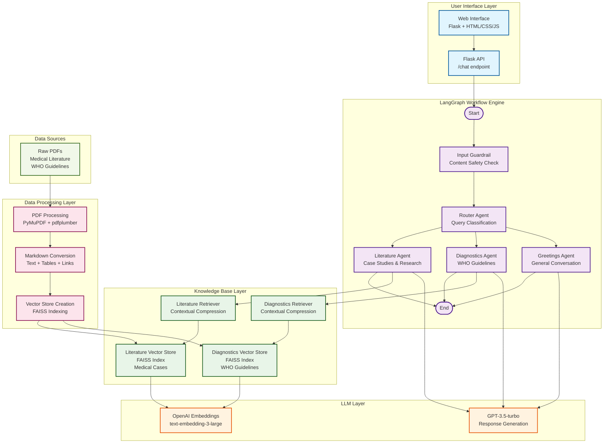
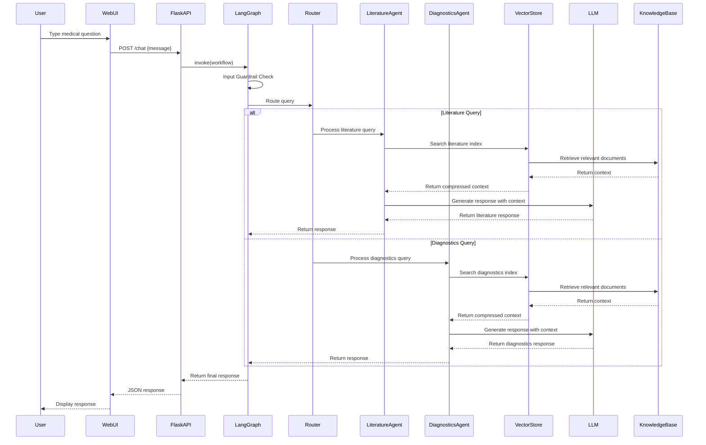
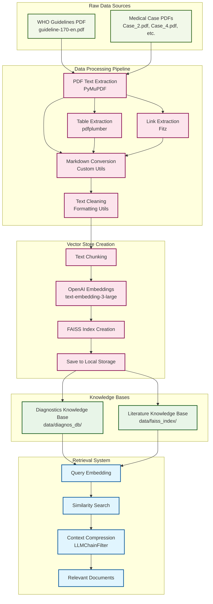
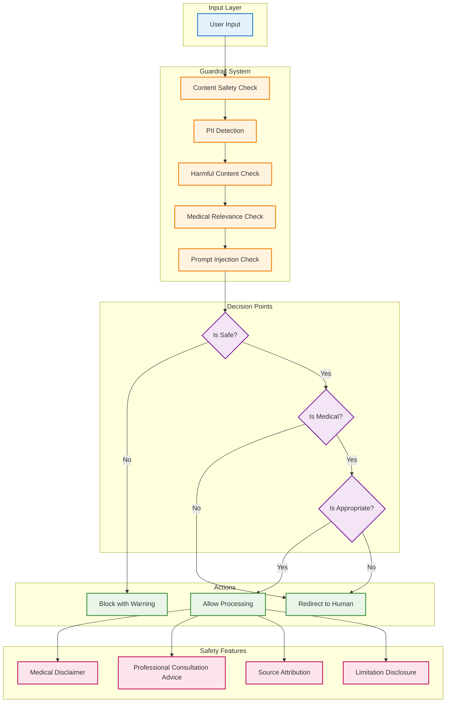
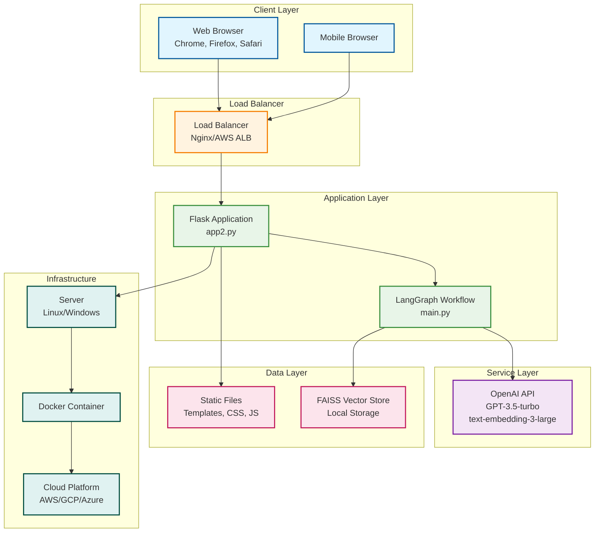

# Clinical AI Chatbot - Architecture Diagram

## System Architecture Overview

## Detailed Component Architecture

```mermaid
graph LR
    %% Router Agent Details
    subgraph "Router Agent"
        ROUTER_INPUT[User Query]
        ROUTER_LLM[GPT-3.5-turbo<br/>Structured Output]
        ROUTER_DECISION{Classification<br/>Decision}
        ROUTER_OUTPUT[Route to Agent]
    end

    %% Literature Agent Details
    subgraph "Literature Agent"
        LIT_INPUT[Literature Query]
        LIT_CHAIN[Literature Chain]
        LIT_PROMPT[Literature Template]
        LIT_OUTPUT[Literature Response]
    end

    %% Diagnostics Agent Details
    subgraph "Diagnostics Agent"
        DIAG_INPUT[Diagnostics Query]
        DIAG_CHAIN[Diagnostics Chain]
        DIAG_PROMPT[Diagnostics Template]
        DIAG_OUTPUT[Diagnostics Response]
    end

    %% Vector Store Details
    subgraph "Vector Store System"
        QUERY[Query Text]
        EMBEDDING[Text Embedding]
        SIMILARITY[Similarity Search]
        CONTEXT[Retrieved Context]
        COMPRESSION[Context Compression]
    end

    %% Chain Components
    subgraph "Chain Architecture"
        RETRIEVER[Retriever]
        PROMPT[Prompt Template]
        LLM[Language Model]
        PARSER[Output Parser]
    end

    %% Connections
    ROUTER_INPUT --> ROUTER_LLM
    ROUTER_LLM --> ROUTER_DECISION
    ROUTER_DECISION --> ROUTER_OUTPUT

    LIT_INPUT --> LIT_CHAIN
    LIT_CHAIN --> LIT_PROMPT
    LIT_PROMPT --> LIT_OUTPUT

    DIAG_INPUT --> DIAG_CHAIN
    DIAG_CHAIN --> DIAG_PROMPT
    DIAG_PROMPT --> DIAG_OUTPUT

    QUERY --> EMBEDDING
    EMBEDDING --> SIMILARITY
    SIMILARITY --> CONTEXT
    CONTEXT --> COMPRESSION

    RETRIEVER --> PROMPT
    PROMPT --> LLM
    LLM --> PARSER

    %% Styling
    classDef agentStyle fill:#e3f2fd,stroke:#1976d2,stroke-width:2px
    classDef vectorStyle fill:#e8f5e8,stroke:#388e3c,stroke-width:2px
    classDef chainStyle fill:#fff3e0,stroke:#f57c00,stroke-width:2px

    class ROUTER_INPUT,ROUTER_LLM,ROUTER_DECISION,ROUTER_OUTPUT,LIT_INPUT,LIT_CHAIN,LIT_PROMPT,LIT_OUTPUT,DIAG_INPUT,DIAG_CHAIN,DIAG_PROMPT,DIAG_OUTPUT agentStyle
    class QUERY,EMBEDDING,SIMILARITY,CONTEXT,COMPRESSION vectorStyle
    class RETRIEVER,PROMPT,LLM,PARSER chainStyle
```

## Data Flow Architecture

## Knowledge Base Architecture

## Security and Safety Architecture

## Deployment Architecture

## Key Architecture Features

### 1. **Modular Design**
- Separated concerns with distinct agents for different medical domains
- Pluggable architecture allows easy addition of new knowledge domains
- Independent vector stores for different types of medical information

### 2. **Scalability**
- LangGraph's stateful workflow management
- FAISS vector search for efficient retrieval
- Flask-based API for horizontal scaling
- Docker containerization support

### 3. **Safety & Compliance**
- Comprehensive input validation and content filtering
- Medical disclaimers and professional consultation recommendations
- Source attribution and limitation disclosures
- PII detection and protection

### 4. **Performance**
- Contextual compression for relevant information retrieval
- Cached vector embeddings for fast similarity search
- Asynchronous processing capabilities
- Optimized prompt templates for efficient LLM usage

### 5. **User Experience**
- Real-time chat interface with audio feedback
- Text-to-speech for accessibility
- Responsive design for multiple devices
- Clear medical disclaimers and professional guidance 
